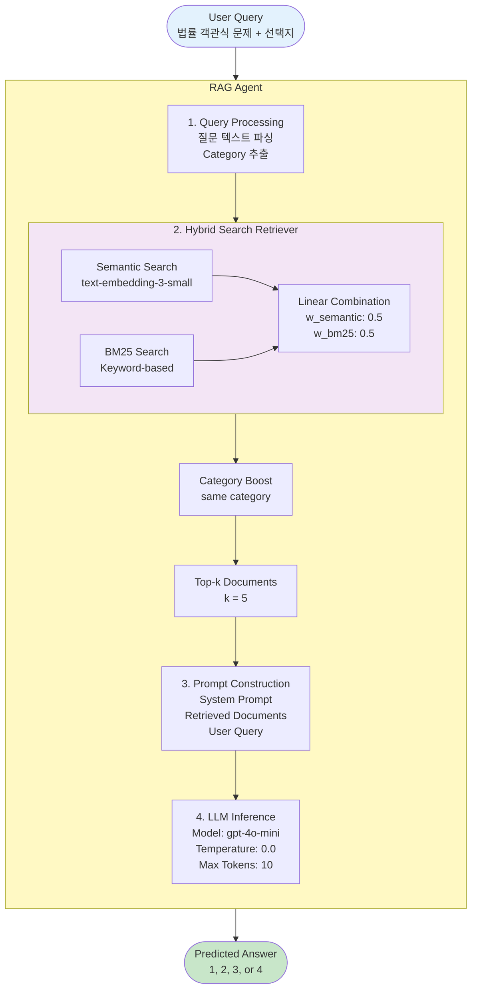

# RAG Agent System for Legal Question Answering

법률 객관식 문제를 위한 RAG (Retrieval-Augmented Generation) 기반 AI 에이전트 시스템입니다.

---

## 🚀 시스템 구축

### 초기 설정

```bash
# 1. 환경 설정 및 데이터 처리
bash scripts/setup.sh

# 2. .env 파일에 OpenAI API Key 설정
# OPENAI_API_KEY=sk-your-actual-api-key-here
```

**setup.sh 수행 작업:**

- 데이터 전처리 (`train.csv` → `documents.json`)
- 임베딩 생성 (OpenAI `text-embedding-3-small`)
- ChromaDB 벡터 스토어 구축

---

## 🏗️ 시스템 구조



### 핵심 컴포넌트

- **RAGAgent**: RAG 기반 추론 시스템 (`src/agent/rag_agent.py`)
- **QuestionRetriever**: Hybrid Search (Semantic + BM25) 구현 (`src/agent/retriever.py`)
- **FastAPI Server**: RESTful API 서버 (`src/api/main.py`)

---

## 🌐 Inference 서버 실행

### Docker Compose (권장)

```bash
docker-compose up --build
```

**서버 주소:** http://localhost:8000

### 로컬 실행

```bash
uv run uvicorn src.api.main:app --host 0.0.0.0 --port 8000
```

### API 사용 예시

```bash
# Health Check
curl http://localhost:8000/health

# 질문 예측
curl -X POST http://localhost:8000/predict \
  -H "Content-Type: application/json" \
  -d '{
    "query": "경비업법령상 특수경비업자에 관한 설명으로 옳지 않은 것은?\n1. 국가중요시설의 경비\n2. 공항 보안검색\n3. 일반 건물 경비\n4. 항만 경비"
  }'
```

---

## 📊 벤치마크 성능

### Dev Set 평가 결과 (최종)

| top_k | semantic | bm25 | category_boost | Accuracy   |
| ----- | -------- | ---- | -------------- | ---------- |
| 5     | 0.50     | 0.50 | 0.00           | **55.21%** |

### 카테고리별 성능

| Category     | Accuracy         | Samples  |
| ------------ | ---------------- | -------- |
| Law          | 135/230 (58.70%) | 89%      |
| Criminal Law | 11/29 (37.93%)   | 11%      |
| **Overall**  | **146/259**      | **100%** |

### 재현 방법

docker-compose 빌드 완료 후 아래 명령어로 평가를 실행할 수 있습니다:

**Dev Set 평가:**

```bash
uv run python -m src.evaluation.evaluate_category_aware \
    --dataset dev \
    --top-k 5 \
    --semantic-weight 0.5 \
    --bm25-weight 0.5 \
    --category-boost 0.0
```

**Test Set 평가:**

```bash
# data/test.csv 파일이 준비되어 있어야 함
uv run python -m src.evaluation.evaluate_category_aware \
    --dataset test \
    --top-k 5 \
    --semantic-weight 0.5 \
    --bm25-weight 0.5 \
    --category-boost 0.0
```

---

## 📁 프로젝트 구조

```
ai-assignment/
├── data/
│   ├── train.csv                          # 학습 데이터
│   ├── dev.csv                            # 평가 데이터
│   └── processed/documents.json           # 전처리된 문서
│
├── vector_store/chroma/                   # ChromaDB 벡터 스토어
│
├── src/
│   ├── agent/                             # RAG Agent 구현
│   ├── api/                               # FastAPI 서버
│   ├── preprocessing/                     # 데이터 전처리
│   └── evaluation/                        # 평가 스크립트
│
└── evaluation_results/                    # 평가 결과
```

---
